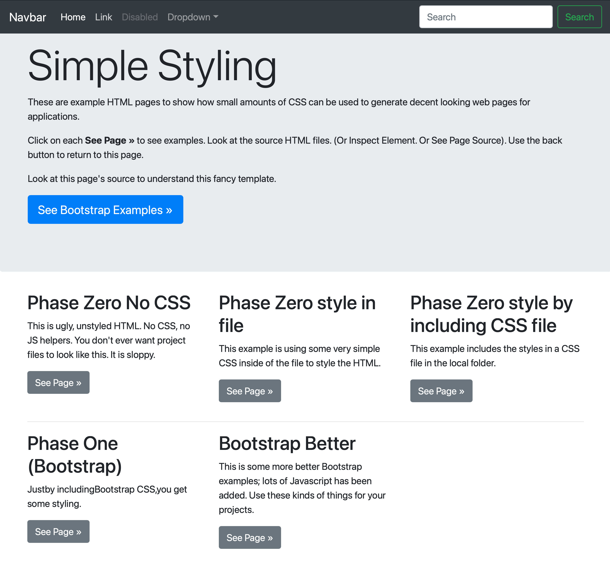

# SeeEssEssBeginnings

This repo is aimed at showing how basic HTML can be styled simply and easily for ZipCode projects.

in a terminal, at the top of this repo, run

```
python3 -m http.server 9000
```

This will run a ver simple web server with the document root in the top level repo directory.

then click on [http://localhost:9000/](http://localhost:9000/)


